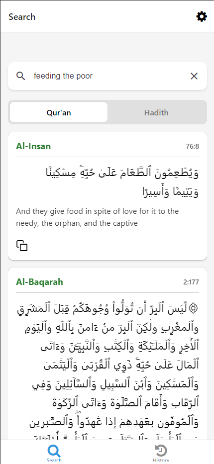
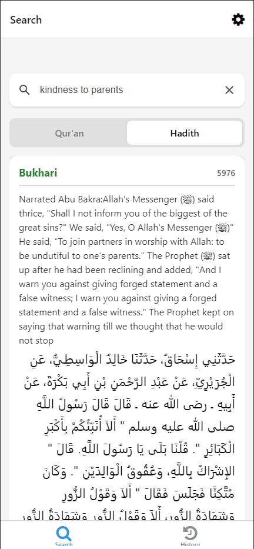

  
# Ilm Search

**A hybrid semantic search engine for Islamic texts that bridges the gap between Natural Language Understanding (AI) and Deterministic Data Integrity.**

## The Problem
Standard AI models (like ChatGPT) often "hallucinate" religious citations, mixing up verse numbers or slightly altering texts. Traditional search engines require exact keyword matches (e.g., user must type "sadaqah" instead of "giving money").

## The Solution
**Ilm Search** utilizes a **Hybrid Retrieval Architecture**. It uses an LLM strictly for *intent recognition* and *keyword extraction*, while performing the actual data retrieval against a local, immutable dataset of authentic texts (Quran & Hadith). 

**Result:** The flexibility of AI conversation with the mathematical accuracy of a database.

---

## Interface

| Home / Search | Quran Results | Hadith Results |
|:---:|:---:|:---:|
|  |  |  |

---

## Key Features

* **Natural Language Querying:** Users can ask questions like "Verses about patience during hardship" or "What are the rights of neighbours?" without needing to know terms like Sabr or Huquq.
* **Zero-Hallucination Architecture:** By decoupling the *reasoning layer* (AI) from the *knowledge layer* (Local JSON), the app guarantees that every displayed verse and hadith exists 100% as written in the source texts.
* **Dual-Source Retrieval:** Simultaneously queries the **Quran** and major Hadith collections.
* **Optimized Latency:** Utilizes `gpt-4o-mini` for sub-second keyword extraction and local Python filtering for instant result rendering.

---

## Technical Architecture

This project employs a **Client-Server** architecture:

### 1. The Frontend (React Native + Expo)
* Delivers a cross-platform (iOS/Android) native experience.
* Features a clean, card-based UI with "Split-Action" copying (Arabic vs. English).

### 2. The Backend (Python + FastAPI)
The backend functions as a **Semantic Proxy**:
1.  **Receive Query:** Endpoint accepts natural language string.
2.  **Semantic Indexing (OpenAI)**: The LLM translates natural language directly into precise canonical references (e.g., "Universe expansion" → 51:47), instantly mapping user intent to specific database indices without relying on keyword guessing.
3.  **Deterministic Search:** The Python service performs an O(n) scan on locally hosted, verified JSON datasets.
4.  **Response Aggregation:** Quran verses and Hadiths are unified into a single JSON response.
